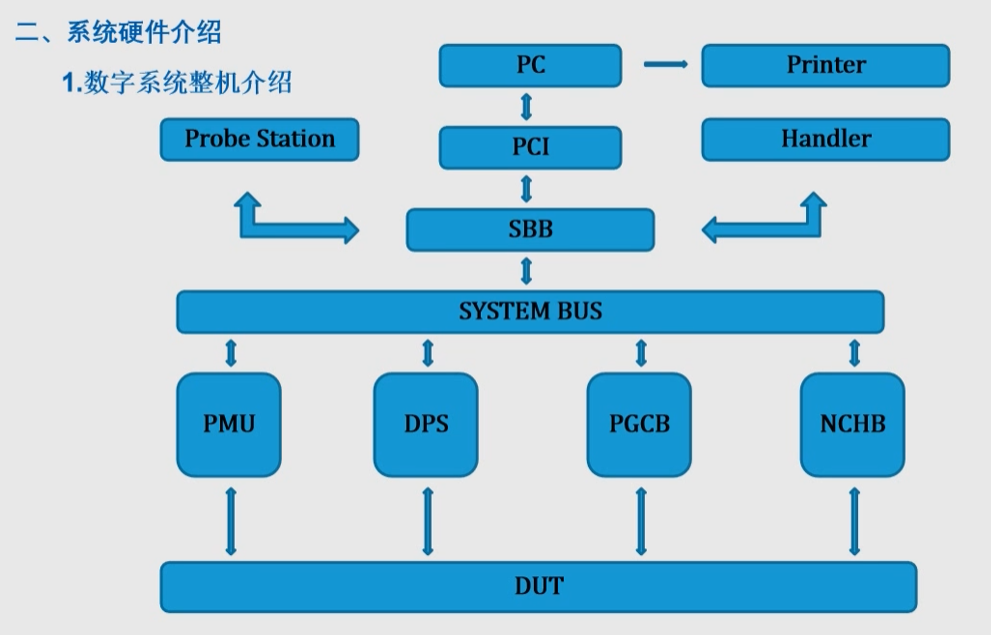

# 数字测试
## 硬件介绍

### 系统单板
- PCI
	- 计算机与系统的接口
	- 计算机总系统与测试系统总线接口
- SBB
	- 分开PCI发送的地址数据
	- 向测试系统发送地址数据
	- 返回数据给PCI
	- 控制Handler和Probe Station
	- 控制机箱外部指示灯
- PMU
	- 工作方式
		- 加压测流，加流测压，直接测压
	- 电机驱动，$\pm 15V$
	- 电流驱动，$\pm 300MA$
	- 全量程电压电流箝位保护
	- 16bit施加，测量精度
	- 采用Kelvin连接法测试DUT
- 