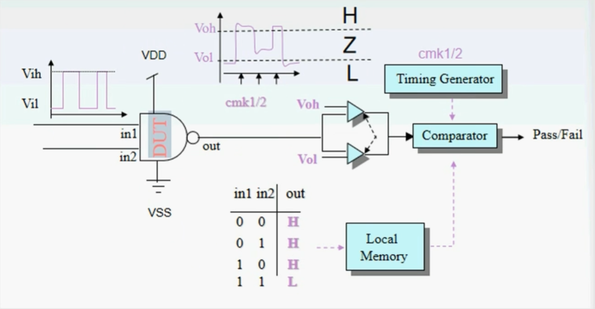
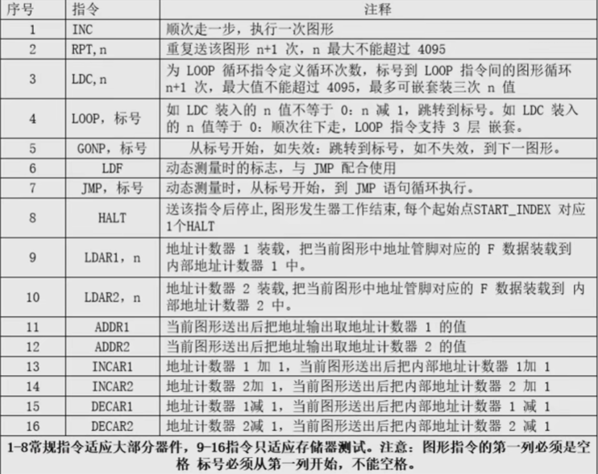
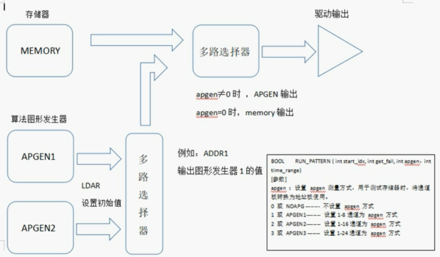
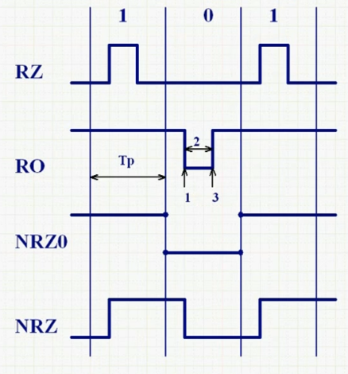

# 数字测试
## 硬件

### 系统单板
- PCI
	- 计算机与系统的接口
	- 计算机总系统与测试系统总线接口
- SBB
	- 分开PCI发送的地址数据
	- 向测试系统发送地址数据
	- 返回数据给PCI
	- 控制Handler和Probe Station
	- 控制机箱外部指示灯
- PMU
	- 工作方式
		- 加压测流，加流测压，直接测压
	- 电机驱动，$\pm 15V$
	- 电流驱动，$\pm 300MA$
	- 全量程电压电流箝位保护
	- 16bit施加，测量精度
	- 采用Kelvin连接法测试DUT
- DPS
	- 加压， $\pm 15V$
	- 测流，$\pm 250 MA$
- PGCB & NCHB
	- 产生驱动时钟，比较时钟
	- 14个继电器控制位
	- 产生驱动电平，比较电平
	- 存储驱动数据和失效数据
- ADAPTER
	- 包括PIN14, PIN16, PIN24, PIN48等多种适配器
## 软件
(视频用的VC++，不需要管，现在安装的是VS)

系统软件四种运行模式：创建，图形编辑，设置，测试

- 图形文件
	- 用于描述测试图形及图形顺序流向控制。
	- 图形编译：.mdc文本文件 -> .mdv二进制目标文件
	- 
	- ```
	  // 初始指定
	  MEM_SOUTCE_15;
	  
	  // 定义管脚
	  PINDEF
	  < 管脚名称 > =< I | O | IO >,< BIN >,(通道号)  //二进制
	  < 管脚组名称 >(数值..数值) =< I | O | IO >,< HEX >,(通道号)  //十六进制
	  
	  // 定义管脚与通道对应关系
	  PIN_TO_CHANNEL
	  1..6=1..6    // 芯片引脚1-6 对应 测试机1-6通道
	  
	  // 编辑图形指令及数据
	  MAIN_F
	  
	  // 数据段标记
	  START_INDEX(标号)
	  
	  /*
	  // 图形指令格式（注意空格）
		  | 指令			（图形）
		  |标号 指令		（图形）
		  | 指令，参数		（图形）
		  |标号 指令，参数	（图形）
	  
	  0、1：二进制方式
	  L、H：二进制方式
	  T：十六进制方式，表示后面数据为输出
	  X：表示对应通道不测试
	  */
	  
	  // 结束
	  HALT
	  
	  // 图形文件结束
	  END.
	  ```
	- 
	- 
- 测试程序
	- 产生.dll
	- LOAD_PATTERN()，目标图形文件->测试系统存储器
	- RUN_PATTERN()


SET_INPUT_LEVEL(double Vih, double Vil);  
SET_OUTPUT_LEVEL(double Voh, double Vol);

波形驱动格式
- NRZ（非归零方式）
- NRZ0（满周期）
- RO（归一格式）
- RZ（归零格式）
- 
- 设置波形(TODO)
	1. SET_PERIOD(Tp);  // 执行一行INC指令的时间(ns)
	2. SET_TIMMING(1, 2, 3);  // 1：前沿，2：后沿，3：选通
	3. SET_INPUT_LEVEL(VIH, VIL);
	4. FORMAT(NRZ0, CH); //指定通道波形格式
	5. RUN_PATTERN(Index, 1, 0, 0); // 运行测试程序
	6. SET_OUTPUT_LEVEL(VOH, VOL);

```cpp
// 设置DPS测量条件
void SET_DPS(BYTE No, double Vdd, unsigned int Vdd_Unit, double Iclamp, unsigned int Iclamp_Unit);

// 测量电流值，比较上下限是否失效，显示测试结果到显示设备
BOOL DPS_MEASURE(BYTE No, BYTE IRange, unsigned int Delayms, CString csItem, CString csUnit, double flccMax, double flccMin);
double DPS_MEASURE(BYTE No, BYTE IRange, unsigned int Delayms);

// 关闭DPS
void DPS_OFF(BYTE No);

// 设置PMU测试条件
void PMU_CONDITIONS(unsigned int Mode, double Value, unsigned int Value_Unit， double Clamp_Value, unsigned int Clamp_Unit);

// 使用PMU测量直流参数
BOOL PMU_MEASURE(CString csPin, unsigned int tDelay, CString csItem, CString csUnit, double fUpLimit, double fDnLimit);
double PMU_MEASURE(unsigned int pin, unsigned int tDelay);

// 运行图形
BOOL RUN_PATTERN(int start_idx, int get_fail, int apgen, int time_range);
BOOL RUN_PATTERN ( CString csltem, int start_idx, int get_fail,int apgen, int time_range);

// 测试完成后分箱处理
void BIN(BYTE bin);

// 显示测试项目及结果
void SHOW_RESULT(CString csltem, double measure_value, int csUnit, double fUpLimit, double fDnLimit);

// 延时(ms)
void Delay(double fMs);
```

数据手册
- 管脚图
- 功能真值表
- 逻辑框图
- 工作条件及电参数

连接性测试  
功能性测试
- VIK
- VOH
- II
- IIH
- IIL
- IOS
- ICCH
- ICCL