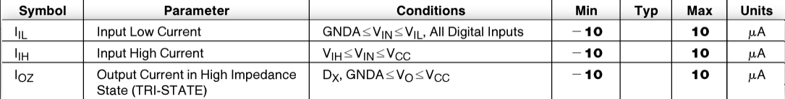
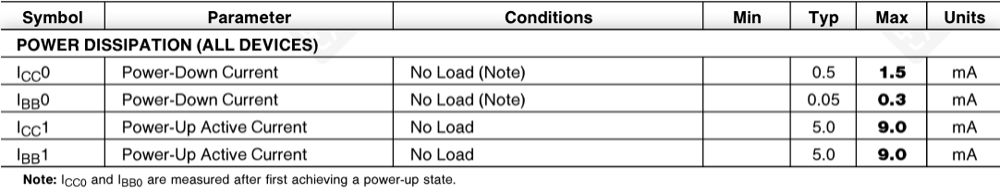
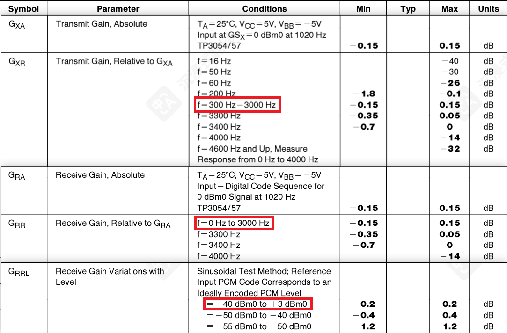
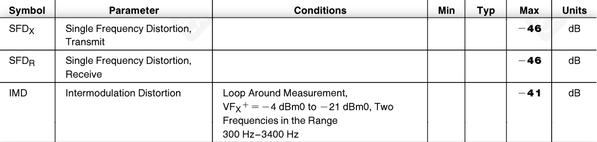

# TP3057
## 引脚
1. 电源
    - $\text{V}_{CC}$(+5V)
    - $\text{V}_{BB}$(-5V)
    - GNDA
2. 时序
    - $\text{MCLK}_R$ (PDN)
    - $\text{MCLK}_X$
    - $\text{BCLK}_R$(CLKSEL)
    - $\text{BCLK}_X$
    - $\text{FS}_R$
    - $\text{FS}_X$
3. 输入
    - $\text{D}_R$
    - $\text{VF}_X\text{I}^+$
    - $\text{VF}_X\text{I}^-$
4. 输出
    - $\text{D}_X$
    - $\text{VF}_R\text{O}$
    - $\overline{\text{TS}_X}$
5. 特殊
    - $\text{GS}_X$

数字输入 $^①$：所有时序引脚+ $\text{D}_R$

## functional description
> [!warning]
> AI总结
### power-up
同时满足：
- MCLKR不能为高电平
- 存在FSX和/或FSR帧同步脉冲

DX**第二个**FSX脉冲才从高阻态恢复
### power-down
只需满足其一：
- MCLKR高电平
- FSX和FSR低电平

最后一个帧脉冲后约**1ms**进入掉电

### 同步操作
- 收发两侧共用MCLKX
- MCLKR用静态电平，不再单独送接收主时钟
- 接收位时钟也可共用BCLKX，BCLKR/CLKSEL变成模式选择脚
### 异步操作
- 发送和接收可分别使用各自时钟
- MCLKX、MCLKR不必同步
- FSX必须同步于MCLKX和BCLKX
- FSR必须同步于BCLKR
- BCLKR必须是真实时钟输入，不再用静态逻辑电平替代

### 短帧同步
上电后默认模式
### 长帧同步
FSX、FSR脉冲宽度都必须 ≥ 3个bit clock周期

## 电气参数
### digital interface

- IIL: 低电平输入电流（测试所有数字输入 $^①$）
- IIH: 高电平输入电流（如上）
- IOZ: 高阻态(TRI-STATE)输入电流（仅测试DX）
### power dissipation

- ICC0: 掉电状态下VCC的电流
- IBB0: 掉电状态下VBB的电流
- ICC1: 上电状态下VCC的电流
- IBB1: 上电状态下VBB的电流
> [!note]
> ICC0和IBB0是在先进入一次上电状态后测量
### amplitude response

- GXA: 发送绝对增益
- GXR: 发送相对增益(相对GXA)
- GRA: 接收绝对增益
- GRR: 接收相对增益(相对GRA)
- GRRL: 接收增益随输入电平变化
### distortion

- SFDX: 发送单频失真
- SFDR: 接收单频失真
- IMD: 互调失真