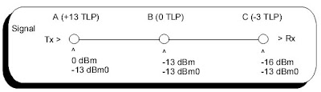

# undef
## dBm0
> From Wikipedia  
> **dBm0**:  
> dBm0 is an abbreviation for the power in decibel-milliwatts (dBm) measured at a zero transmission level point (ZLP).  
> ZLP:  
> When the nominal signal power is 0dBm at the TLP, the test point is called a zero transmission level point, or zero-dBm TLP.  
> TLP:  
> In telecommunications, a transmission level point (TLP) is a test point in an electronic circuit that is typically a transmission channel.

> TLP = dBm − dBm0

dBm: $10\text{log}_{10} \frac{P}{1mW}$  
dBm0的含义是相对于零TLP点的dBm值  

## manual
### transmit section
模拟输入 → 运放增益 → 发送滤波器 → 采样保持 → A-law ADC → 8位PCM → Dx输出
1. 运算放大器 外接两个电阻可以设定增益 可实现超过 20 dB 增益
2. 发送滤波器(单位增益)
   - RC 有源预滤波器
   - 8 阶开关电容带通滤波器，时钟 256 kHz
3. 采样保持电路
4. 压扩型A/D  
  A-law
1. $\text{t}_{max}=2.5\text{Vpk}$
2. FSx 控制什么时候采样，8位编码随后装入缓冲器，并在下一个 FSx 脉冲处通过 Dx 移出
3. 总编码延时约为 165 μs（发送滤波器引起）加 125 μs（编码延时引起），合计 290 μs
### Transmission Characteristics
VCC = +5V ± 5%，VBB = -5V ± 5%，GNDA = 0 V，f = 1.02kHz，VIN = 0dBm0，发送输入放大器接成单位增益同相
$\text{t}_{MAX}$: 最大过载峰值电压, TP3057(3.14dBm0)为2.492Vpk
### ENCODING FORMAT at Dx OUTPUT
`10101010` -> 2.492Vpk  
`11010101`/`01010101` -> 0Vpk  
`00101010` -> -2.492Vpk